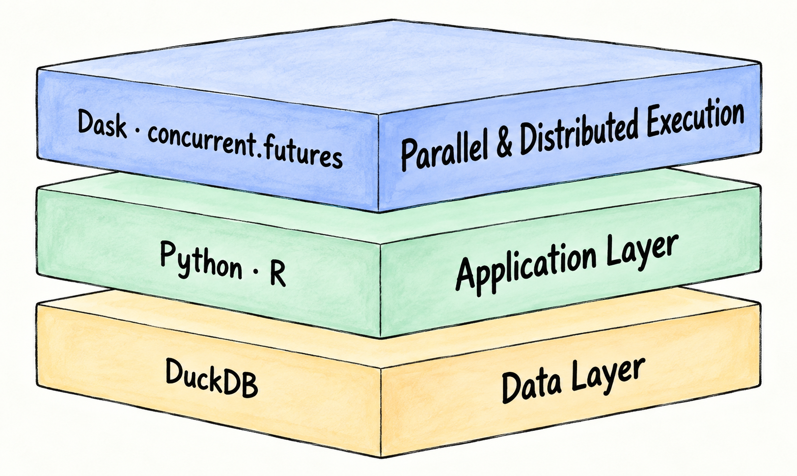

# ShapeFM architecture

The governing long-term direction is documented in the
[ShapeFM research vision](research-vision.md). Architecture and implementation
decisions should preserve its nested-system boundaries, reproducible FFORMA
baseline, expandable forecast and feature pools, alternative meta-learners,
and explicit foundation-model roles in forecasting, features, meta-learning,
combination and adjustment.

The [approved workflow standard and software-layer diagram](poc2-workflow-orchestration-decision.md#software-layers)
define the implementation for existing and future workflows: Prefect orchestration,
Dask compute scheduling, native R/Python adapters, and one Mac DuckDB writer.
Approved on 2 October 2026; Stage 1 was accepted for progression with limitations
on 3 October, and pragmatic Stage 2 is authorised. Full migration remains open. The
[mandatory object-oriented standard](code-standards.md#mandatory-object-oriented-implementation)
governs configuration, data access, storage and scientific objects; Prefect/Dask
orchestrate their operations. See the retained initial evidence in the
[acceptance record](poc2-workflow-orchestration-acceptance.md). Follow the
[AMP-Code instructions](amp-poc2-workflow-orchestration-instructions.md) for the
implementation boundary and update this map with later workflow changes.

### Stage 1 working implementation boundaries

The accepted Stage 1 snapshot uses these responsibilities. Verification gaps
carried into Stage 2 remain in the acceptance record; acceptance is not a claim
that all workflows or capability tests are complete.

| Responsibility | Object and operations | Execution owner / tests |
| --- | --- | --- |
| CLI | `ResearcherCLI.request`, `present`, `present_error`; `ResearcherRequest` carries command values | `00_main.py` connects request, action and presentation; `test_main` |
| Researcher actions | `ResearcherActions`, `ProcessAction`, `WindowPreparationAction` | Existing Prefect experiment/preparation flow; read-only actions stay direct; `test_main` |
| Configuration | Existing `ExperimentConfiguration` loaded through `load_database_configuration` | DuckDB remains authoritative after creation; `test_configuration` |
| GIFT-Eval source | `ConfiguredGiftEvalSource.fingerprint`, `metadata`, `records` | Bounded raw Arrow records; `test_import` and import integration tests |
| Import storage | `ImportCoordinator.begin_configured_import`, `prepare_source_record`, `finish_configured_import` and task/result transactions | `gate1_import_flow` explicitly reads, computes and commits; the historical direct import API remains a Stage 2 compatibility path |
| Process/event storage | `ProcessStorage.transition`, `validate`; `ExecutionEventStorage.start`, `finish`, `record_prefect_identity` | Coordinator-local SQL; `test_process_storage`, `test_main` |
| Forecast storage | `ForecastStorage.prepare_pending_jobs`, `commit_response`, `verify_completion` | Opened inside the Mac flow; never a distributed task argument; `test_forecast_flow` |
| Forecast providers | `DistributedForecastProvider`, `LocalAutoArimaProvider`, `LocalChronosProvider` | Native R/Chronos adapters retain scientific behavior; `test_experiment_execution` |
| Forecast workflow | `ordinary_forecast_flow` submits named compute tasks with explicit `DaskTaskRunner(address=...)` | Prefect retries; Dask resources and bounded in-flight submission; `test_forecast_flow` |
| Infrastructure | Existing `ExecutionProfile`, `ExecutionSettings`, `ManagedTuningCluster`, writer locks | Central profile/preflight remains mandatory; existing execution tests |

The ordinary Gate 4 custom dispatch body has been removed. Tuning, Gates 2/3/5/6,
window preparation, historical acceptance support and direct import compatibility
still retain their documented Stage 2 paths. Their complete OOP migration is not
claimed by this checkpoint. R scientific functions and the delegating AutoARIMA
adapter are unchanged.

The 3 October correction snapshot changes the affected boundaries as follows:
all forecast providers expose `forecast(model, batch)`; the task wrappers no
longer inspect provider types. `ForecastSafetyPolicy` carries effective profile
controls into the existing R reservation and continuous child monitor. Import
attempt/result/failure bookkeeping belongs to public `ImportCoordinator`
operations. `ProcessStorage` verifies imported source values/windows, preprocessing
hashes/contracts and recomputed transformations before skip or predecessor reuse.
Historical R integer-JSON hashes remain valid after DuckDB DOUBLE conversion.

The forecast flow refills bounded slots in Prefect completion order instead of
waiting for an entire mixed CPU/GPU wave. Disabling overlap still imposes the
configured CPU/GPU phase boundary. Normal preflight compares actual source,
configuration/support files and locks on every worker, permitting matching dirty
source while rejecting missing, stale or extra runtime files. Legacy callers
without a manifest retain the clean-tree check.

The approved closure follow-up implements runtime profile v3 as an explicit
operational override, preserving historical experiment snapshots. The profile's
`distributed_topology(requires_gpu)` supplies launch and preflight counts:
23 CPU workers for CPU-only work, or 23 CPU plus 15 logical GPU workers.
Ordinary AutoARIMA submission enforces its profile-owned eight-batch cap inside
the overall bound. CPU work retains submission capacity when GPU tasks block;
the approved no-overlap profile still executes separate CPU/GPU phases.
AutoARIMA requests the existing `CPU` and `AUTOARIMA_R_SLOT` resources, aligning
ordinary forecasting with tuning's Ubuntu large-fit placement. Registered Mac
workers do not prove Mac model computation: bounded closure checks had only
5–6 GiB available on Mac, below the unchanged 12 GiB fit budget plus 3 GiB floor.
Native CPU overlap is carried into Stage 2; current ordinary AutoARIMA routing
excludes Mac independently of its available memory. Pending
forecast state determines GPU need; a completed second resume launches only the
CPU pool, without changing the configured GPU capacity or historical settings.

Protected Chronos uses shared startup admission and the existing continuous
owned-child monitor. A machine-local lock gates startup until readiness and a
fresh host/GPU sample, then releases before inference. Pressure/probe failures
stop owned children; protected models close at the batch boundary rather than
remaining resident without monitoring. This is reactive pressure protection,
not a predictive GPU fit reservation: the profile defines no GPU fit budget.
No inference-long global lock or second resource manager is introduced.
See the acceptance record for normal-route evidence, Stage 1 acceptance and
remaining limitations. Stage 2 consolidates only retained workflows and required
approved methods; it does not preserve every legacy module for its own sake.

```text
00_main → CLI request → researcher action → Prefect gate
                          │                   │
                          │                   ├─ configured GIFT source → import storage
                          │                   │
                          │                   └─ forecast flow → named Dask compute tasks
                          │                                      │
                          └─ read-only retrieval       native R / Chronos provider
                                                                 │
                                                   validated Mac DuckDB commit
```

Prefect-Dask serializes parent flow parameters as task context. Consequently,
passing storage only to a flow (rather than explicitly to a compute task) is
still unsafe: the flow now receives paths/identities and opens storage locally.
The raw Arrow source adaptation preserves null-versus-NaN missingness and
per-file hashes. The official GIFT-Eval reader is lazy too, but its NumPy/GluonTS
formatting does not retain Arrow validity metadata; it remains the evaluator.

The approved minimal POC2 approach is described in
[object adaptation and seasonal period](poc2-object-adaptation.md). It reuses
existing adapters and stored configuration; implementation is tracked separately
from the long-term research vision.

[Gate 4 seasonal period tuning](poc2-seasonal-period-tuning.md) is an approved,
opt-in configuration-v3 extension. It compares baseline and estimated-period
policies per series/model using historical validation, while keeping
preprocessing and benchmark evaluation periods independent. Its initial
acceptance is deliberately restricted to 100 M4 Daily series, AutoARIMA and ETS.

## Research architecture

The [combined rolling-window and split decision](poc2-window-training-architecture.md)
joins IDs 011 and 016: parent/child storage, central experiment settings,
stride equal to input window plus future horizon, and one S1 train/test split
by original series. The researcher approved the combined scope on 1 October 2026.
Version 5 is published at 9728fce. Configuration v6 preserves v5 while correcting
execution safeguards, retrieval identity validation, R-compatible split
rounding, bounded memory and central settings. Focused checks and the corrected
100-series 8-Mac/15-Ubuntu acceptance passed on 2 October 2026 and was published
at 22e41bb. The final review corrections now enforce the local guard inside the
coordinator and route bounded complete blocks through tsai in the actual
preparation path. A fresh 100-series two-host acceptance passed without changing
the agreed architecture or scientific settings. Features, labels, Mantis
training and prediction remain outside this increment. See the
[acceptance record](poc2-rolling-windows-acceptance.md).


The research view has seven layers: Research Interface, Experiment Management,
Evaluation & Benchmarking, Forecast Decision, Modelling & Representation,
Time-Series Engineering, and Research Data. Across those layers, the Experiment
Grid is the experiment component, ShapeFM Decision is the scientific function,
Benchmark Evaluation is the evaluation service, and Research Feedback closes
the iteration loop.

The persistent research objects are a Time-Series Record (data object), an
Experiment (research object), an Evidence Report (information object), and the
Research Schema (data structure). They move through one six-process cycle:

```text
01 Import → 02 Preprocess → 03 Transform → 04 Forecast → 05 Combine → 06 Evaluate
     ▲                                                                    │
     └──────────────────────────── Iterate ────────────────────────────────┘
```

This structure supports reproducible, traceable, scalable research while
avoiding full reruns, data sprawl, and manual orchestration.

## Technical layers

The image below predates the orchestration migration; the governing current
software-layer diagram is linked above. The target layers are listed below;
the initial implementation remains under refactoring and review:

1. **Research interface.** `src/python/00_main.py` is the sole public command.
2. **Prefect workflow layer on Mac.** Readable experiment, gate and preparation
   flows orchestrate meaningful object operations and retain operational history
   in local SQLite. Scientific result persistence and task caching are disabled.
3. **Dask compute layer.** Eligible bounded jobs use the approved Mac/Ubuntu
   pools and execution profile; local coordinator work remains local.
4. **Native objects/adapters.** Configured source/provider objects encapsulate
   Python/R library operations and small reusable functions; remote computation
   has no writable database access.
5. **Acceptance/storage layer on Mac.** A coordinator-local storage object owns
   serialized commits of validated authoritative research state to DuckDB.



The older three-layer image remains useful for the scientific/data interior,
but the approved diagram is authoritative for workflow ownership.

Gate 3 owns fitted transformations and their inversion state. The R forecast
pool receives an already prepared numeric series at Gate 4 and returns
independent probabilistic base forecasts; it does not interpret transformation
expressions, combine forecasts, evaluate them, or write to DuckDB. The common
request, result, probabilistic assumptions, and visible seasonal-naive fallback
are documented in [`forecast-methods.md`](forecast-methods.md).
Gate 1 missingness preservation, Gate 2 modes, and evaluation masking are
documented in [`preprocessing.md`](preprocessing.md).

Configuration v4 adds the Gate 3 `standardise_sample_v1` recipe alongside the
no-transformation `identity` route. Gate 3 fits each state from that variant's
prepared history only, stores it in `transformed_series.parameters`, and Gate 4
uses the same state to invert supplied mean, median and quantiles. The portable
state has exactly `recipe`, `version`, `centre`, `scale`, `count` and `constant`.
R and Python implement the same sample-SD rule and positive affine inverse.
Older `minmax_then_standardize` results retain their historical interpretation;
they are not relabelled or migrated.

### Current forecast-pool integration boundary

The approved R library registers the nine original FFORMA-derived forecast
methods in `src/r/util/forecast_methods.R`, with common validation and visible
seasonal-naive fallback. The current production experiment does not yet plan
all nine methods: configuration and Process 04 orchestration select only
AutoARIMA and Chronos-2, and `src/r/04_01_forecast_auto_arima.R` invokes the R
pool for AutoARIMA. Connecting the other eight registered R methods to model
selection, task planning, execution, persistence and retrieval remains
outstanding approved forecast-pool integration work. It is documented rather
than implemented in this closure task.

## Identity, transactions, and restart

Dataset identity is derived from pinned source revisions and material import
configuration. Experiment, variant, task, forecast, and evaluation identities
remain independent of worker placement and concurrency. Each successful result
and task completion is committed atomically by the coordinator. Failed or
interrupted work remains retryable; completed work is skipped on restart.

The Dask scheduler is transient and non-authoritative. The Mac hosts the
coordinator and scheduler. The [approved execution policy](execution-policy.md)
governs worker capacity, memory-safe admission and availability exceptions.
Objective 1's one-CPU/one-GPU topology is a historical limited acceptance case,
not the heavy-test default. Chronos work uses `CHRONOS_GPU_SLOT` on the physical
Ubuntu GPU; an R-only Gate 4 workload must not require that capability.

All heavy paths, including tuning, must consume the same resolved execution
profile and verify code, dependencies and actual workers before dispatch.
No model-specific serial loop may silently bypass the scheduler. The
[approved safeguard follow-up](amp-poc2-execution-safeguards-instructions.md)
closes the reviewed optional-profile bypass, hardcoded Mac allocation/concurrency
and admission-only memory checks. The versioned profile now owns 8 Mac CPU,
15 Ubuntu CPU and 15 logical Ubuntu GPU slots; R-only tuning launches 23 CPU
workers and no GPU workers. Memory-aware admission and continuous owned-process
monitoring preserve the 3 GiB Mac and 16 GiB Ubuntu floors. The historical
800-forecast recovery remains separate evidence and was not repeated.

## Schema evolution

Schema versions preserve prior rows while adding experiment identity, task and
attempt state, scientific forecasts, and official evaluation provenance.
Arrays remain in DuckDB list columns. Execution addresses, transient model
weights, logs, and telemetry are not authoritative database content.

## Experiment configuration authority

This decision begins POC2 Phase 2 Import. Each DuckDB file represents one
experiment and grows as its six processes are completed. The same experiment
may execute Processes 01–03 first and resume Processes 04–06 later without
repeating completed valid work.

Before the database exists, one human-readable JSON file defines the
experiment. It must include these reference fields:

- `date`: the experiment creation date in ISO `YYYY-MM-DD` format;
- `description`: a concise statement of the experiment objective.

For example:

```json
{
  "configuration_version": 2,
  "experiment": {
    "name": "poc2_m4_daily_100_resolved_period",
    "date": "2026-09-30",
    "description": "Validate the central ShapeFM workflow using the pinned GluonTS period convention."
  },
  "reproducibility": {"seed": 1234},
  "pipeline": {"r_period_override": null}
}
```

The Python entry point validates the complete JSON before creating the
database. Database creation stores both the original JSON and its resolved
configuration. From that point, DuckDB is the experiment configuration's
single source of truth; resuming the experiment must not depend on the original
JSON file.

A central Python configuration interface reads the stored configuration and
provides the coordinator with typed values. The coordinator passes each
process or task only the values it requires. Process and worker modules do not
duplicate global settings or issue independent configuration queries.

Scientific settings cannot change silently after database creation. Changing
the dataset, selected series, transformations, forecast horizon, models, or
evaluation method requires another experiment database. Operational settings,
such as worker allocation, may change when resuming, but the values actually
used are appended to the database execution history.

The database records each execution request, including requested processes,
timestamp, code revision, worker allocation, participating hosts, status, and
failure details. These records describe the progressive execution history of
one experiment; they are not separate scientific experiments.

The governing principle is:

> JSON defines a new experiment. DuckDB preserves and controls the experiment.
> The coordinator gives every process and task only the information it needs.

### Evolution across POCs

This is a continuing ShapeFM architecture decision, not a one-time POC2
refactor. Every later POC must begin by reviewing whether it introduces or
changes experiment settings. When it does, the experiment JSON contract,
validation, DuckDB schema or stored configuration, central configuration
interface, affected process and worker inputs, tests, and documentation must
evolve together.

New workflow settings must enter through this configuration path. They must not
be introduced as independent script globals, hidden defaults, or a second
configuration source. Existing experiment databases remain interpretable
through explicit configuration and schema versions; an incompatible scientific
change creates a new experiment database rather than silently changing an
existing experiment.

### POC2 implementation

Configuration versions 1 and 2 are implemented by the typed
`ExperimentConfiguration` interface. Version 2 is the default for new
experiments. Its R preprocessing and R forecasting period is resolved once in
the pinned GIFT-Eval environment: an explicit positive
`pipeline.r_period_override` takes precedence; otherwise the resolver calls
GluonTS `get_seasonality()` with the stored dataset frequency. Benchmark
evaluation seasonality is resolved independently, so an R-period override does
not silently change scoring.

The resolver supports multiple valid GluonTS frequencies and is tested with
Daily, hourly, weekly, monthly, quarterly, yearly and 15-minute frequencies.
That generic resolution does not mean the full production pipeline supports all
GIFT-Eval datasets: the current production configuration, importer validation,
selection and experiment dimensions remain intentionally restricted to M4
Daily. Other datasets require separate compatibility review.

Version 1 remains a supported compatibility contract. Its stored M4 Daily
period-7 setting retains the historical coupled preprocessing, R-model and
evaluation interpretation; existing databases and results are not rewritten.
New-database creation validates the whole document before opening the target
path, builds a temporary sibling database, stores the original and resolved JSON
plus required metadata/hash, creates the six process rows transactionally, and
atomically renames the file. Invalid documents cannot leave a partial target
database.

`experiment_configuration` is the immutable authority record.
`experiment_processes` records the current ordered Process 01–06 state.
`execution_events` is append-only execution evidence containing requested
processes, effective operational configuration, code/host identity, status,
summary, and failure. Scientific task/result tables retain their existing
stable identities and transaction boundaries.

### Optional Gate 4 period tuning

Configuration version 3 adds the approved `seasonal_period_tuning` policy and
selects AutoARIMA plus ETS for a bounded R-only experiment. Versions 1 and 2
remain untuned and preserve their existing task and result interpretation.

For each series, preparation variant and model, Gate 4 creates three expanding
historical folds of horizon `h`, with origins spaced by `h`. Every fold starts
from raw history strictly before the official test. Existing Gate 2 cleaning
and Gate 3 transformation are refitted on that fold's training slice;
validation observations never enter preparation, period estimation or fitting.
Forecasts are inverse-transformed and scored against unmodified finite
validation labels using MAE. Missing labels are excluded rather than imputed.

The baseline is the experiment's resolved R period. The alternative policy
calls `forecast::findfrequency()` on the prepared fold input. `tsfeatures`
seasonal strength is stored as diagnostic evidence, not used as a selection
cutoff. A candidate requires three complete cycles and model support. Ties,
incomplete comparisons, all-missing windows, requested-model fallbacks and
failures retain baseline. If estimated wins, it is resolved and checked again
on the complete prepared history before the normal final forecast adapter runs.

`seasonal_tuning_folds`, `seasonal_period_candidates`,
`seasonal_tuning_validations`, and `seasonal_period_selections` keep the
research trail inspectable. Validation predictions never enter the normal
`forecasts` table, official forecast queries, or Gate 6. The selected final
AutoARIMA/ETS result uses the existing probabilistic forecast contract and
links to its selection through execution metadata.

This procedure searches forecasting policies for a series and model. It does
not claim to discover an immutable true seasonal period. The fixed
preprocessing period and independent official evaluation seasonality are not
tuned.

### Configuration v4 standardisation

Configuration version 4 preserves the version-2 period resolver and normal
AutoARIMA/Chronos route while replacing the new experiment's historical
`minmax_then_standardize` selection with `standardise_sample_v1`. A v4 tuning
document may also carry the version-3 tuning policy, but the committed
standardisation acceptance configuration does not enable tuning.

For a finite nonconstant history, the recipe stores the arithmetic mean and
sample standard deviation with denominator n−1. Exact constants and singleton
histories store the first value as centre, effective scale 1 and
`constant = true`; additional values therefore retain real differences instead
of being collapsed. Apply and inverse operations validate the exact state and
never refit it. Ordered composition is deliberately limited to registered
`identity` and `standardise_sample_v1` steps, applied forward and inverted in
reverse.

Version 4 also declares a positive `pipeline.window_preparation.context_length`.
The shared R/Python utilities implement explicit trailing selection and the
legacy first-value left padding, without deriving a window from horizon or
frequency. This is a tested configuration capability for selected future
consumers; current AutoARIMA and Chronos adapters still receive full prepared
histories and do not yet consume that field.

The fresh 100-series acceptance stopped after Processes 01–03. It validates
import, both preprocessing variants, both transformation variants, persistence,
portable state, and restart. It is not a forecasting, full-pipeline, or accuracy
acceptance and does not alter accepted historical databases. Its configuration
records one sequential Mac worker and Processes 1–3; computationally heavy work
continues to require the approved named 8-Mac/15-Ubuntu execution profile.

### Configuration v5 rolling-window preparation

Configuration version 5 preserves all version-4 processing semantics and adds
one explicit `prepare-windows` capability. Ten frequency definitions store an
input length and future horizon; resolution derives and persists stride as
`input_length + future_horizon`. The production document selects only M4 Daily.
It does not claim full multi-dataset GIFT-Eval support.

The coordinator protects the official training boundary and sends bounded,
complete W+H blocks through pinned tsai 1.0.1 `SlidingWindow`; the returned
inputs and absolute boundaries are the values processed and persisted. It also
allocates eligible original series—not window rows—to S1 train/test using the
pinned tsai splitter, fraction 0.80 and seed 123. Membership and its fingerprint
are persisted before work. Each input is robust-cleaned with the officially
resolved R period and independently fitted with `standardise_sample_v1`; future
observations are transient window-generator inputs only and never enter cleaning,
fitting or child storage.

Local execution is guarded inside the coordinator as well as the CLI. Focused
calls must declare positive limits no greater than 100 series and 200 windows;
the production 632-window acceptance therefore requires the approved named
8-Mac/15-Ubuntu profile even when the coordinator is called directly.

The parent database owns canonical raw observations, official boundaries,
stable numeric lookup aliases and run status. One child database stores the
preparation/split definitions, series membership, restartable tasks, transformed
inputs, fitted state, source positions and provenance. It does not duplicate raw
input or future arrays. Python remains the sole writer. Resume checks parent,
definition, cohort, membership and tested-source fingerprints and reconciles a
completed child with an interrupted parent run record without recomputation.

The complete field contract and evolution procedure are documented in
[`experiment-configuration.md`](experiment-configuration.md). The exhaustive
disposition of former globals, machine settings, protocol constants, and test
expectations is in [`configuration-inventory.md`](configuration-inventory.md).
The scoped follow-up findings and removal candidates are recorded in
[`vision-alignment-review.md`](vision-alignment-review.md).
