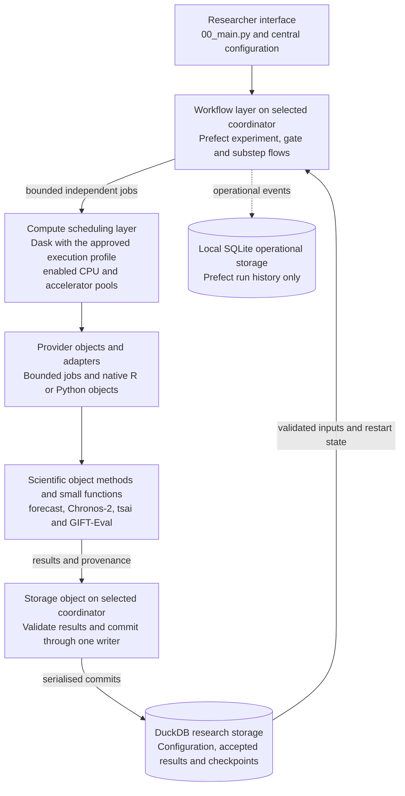

# POC2 workflow orchestration decision

Status: Approved by the researcher on 2 October 2026. This is the continuing
workflow implementation standard for ShapeFM, beginning with this POC2 migration.
Initial implementation/test evidence is retained in
[the acceptance record](poc2-workflow-orchestration-acceptance.md); full migration
acceptance remains open. Stage 1 was accepted for progression on 3 October 2026
under the pragmatic amendment below; Stage 2 is authorised. The researcher's standing direction makes
[object-oriented implementation](code-standards.md#mandatory-object-oriented-implementation)
the standard for this entire project and future projects, with its documented
practical exceptions. POC2 is the current migration increment, not the limit of
that standard. Approval and implementation evidence remain distinct.

Implement under the [AMP-Code instructions](amp-poc2-workflow-orchestration-instructions.md).
The approval covers the architecture, scoped integration and capability tests,
not unrelated scientific changes. The 3 October amendment separately authorises
the reviewed Stage 1 GitHub checkpoint.

## Pragmatic Stage 2 amendment

Approved by the researcher on 3 October 2026: close Stage 1 with its documented
limitations and move the remaining CPU-overlap and scheduler-loss checks into
Stage 2. These are outstanding checks, not failed implementation claims or
tests to relabel as passed. They are not prerequisites for publishing Stage 1.

Prioritise POC2 Objective 2 and already-approved previous-project methods.
Apply the established architecture to retained workflows while consolidating
utilities and retiring obsolete code. Do not perfect paths that will be removed
or add generic machinery for unsupported scenarios. Use the
[pragmatic implementation rule](code-standards.md#pragmatic-implementation);
scientific correctness and data/resource safeguards remain mandatory.

The researcher authorises a normal GitHub push of the reviewed Stage 1 source,
tests, configuration/locks and approved documentation, followed by safe Ubuntu
synchronisation before Stage 2 source work. Future unreviewed work is not covered
by that publication approval. The [current AMP instructions](amp-poc2-workflow-orchestration-instructions.md)
own the sequence and bounded implementation scope. This amendment supersedes
earlier Stage 1 stop/publication restrictions, not the continuing architecture.

## Approved decision

Adopt Prefect to organise experiments, gates and meaningful substeps, using the
existing Dask execution layer for distributed computation. Keep the scientific
functions, language adapters, DuckDB results and central configuration. Organise
implementation in cohesive objects with small methods; Prefect orchestrates
their operations and Dask schedules eligible computation. Objects do not own
competing orchestration. This applies across the current POC2 implementation,
including configuration and GIFT-Eval import, through the staged migration.

The outcome is that all currently supported researcher workflows operate under
one consistent architecture. A first-gate trial is an implementation checkpoint,
not sufficient evidence to close this decision. Acceptance focuses on execution
capabilities and safety, not forecast accuracy or reproducing paper scores.

The researcher also requires a measured simplification outcome: baseline and
final R/Python script counts, per-script line counts and overall totals. The
aim is less project-maintained orchestration and fewer lines overall, accepting
some initial integration code. This is a direction to measure honestly, not a
guarantee or permission to sacrifice readability, documentation or safeguards.

This implements the outer research system in the [research vision](research-vision.md)
and follows the [code standards](code-standards.md) and
[execution policy](execution-policy.md). Those scientific and operational rules
remain in force; implementation evidence belongs in the linked acceptance record,
not in the approval itself.

## Software layers

The diagram shows the approved target architecture, not completed migration. Arrows show
responsibility and data hand-offs, not six additional scientific gates. The
numbered gates and optional preparation workflows remain unchanged.



In words: Prefect coordinates the work, Dask distributes eligible computation,
adapters supply native inputs, existing libraries calculate, and the selected
coordinator validates and saves results. The current profile selects the MacBook
Pro; a future approved profile may select the Mac Studio. Small coordinator-local
work does not need a Dask job. SQLite records workflow history; it is not another
research dataset. DuckDB includes the existing parent/child window databases
where applicable. Worker numbers and safety limits come from the execution
profile, not this diagram. Mantis training and future scientific extensions are
not added here.

## Mandatory use and future changes

All new or modified workflow paths must follow this decision and
[code standards](code-standards.md). Before implementation, identify the owning
layer, step inputs/outputs, prerequisites, validation, retry/restart behaviour
and resource source. Record these concisely in normal source documentation and
tests; do not build an extra contract framework to describe them.

The research vision owns scientific direction, this decision owns workflow
boundaries, and the execution policy and its machine-readable profile own
operational limits. Link these authorities instead of copying independent
settings. If they conflict, stop the affected work and ask for a decision.

Legacy execution can remain only as a named migration/compatibility path until
its replacement passes. Update the diagram, architecture, source documentation
and affected tests with each accepted change. Do not call a new path compliant
because a helper test passed while real work still bypasses it. A change of
framework, storage authority, worker policy or safety guarantee requires an
explicit researcher-approved amendment before implementation. This standard
continues beyond POC2 until superseded by such an amendment.

## IDs 038/041 implementation candidate: Process 06

The approved [table-reproduction increment](poc2-id038-041-table-reproduction.md)
uses the existing gate compute flow; it is not another experiment runner.
Its local checkpoint is recorded in the
[implementation evidence](poc2-id038-041-implementation-evidence.md).

```text
Process 05 stored means + canonical context/actual + stored directions
                             |
          Process 06 coordinator reads one cohort / verified worker cache
                             |
            Prefect gate flow → bounded CPU Dask model/lambda batches
                             |
               one single-threaded R paper-profile calculation
                             |
       coordinator validates and commits aggregate responses as they finish
                             |
         complete-surface selection → selected-only means + SMYL Oracle
                             |
      one completion transaction: diagnostics, horizon results, tables/ranks
```

The ordinary cleaned-origin directional evaluations remain separate and retain
their accepted definition. The paper profile uses the historical raw context
origin for all participating models. Restart reuses fingerprint-verified
aggregates; no worker writes DuckDB and no sensitivity task requests a GPU.
Distributed two-machine contribution and scientific reproduction are not yet
accepted by this local checkpoint.

## Why this approach

The reviewed baseline is b4da3fc. The
[main entry point](../src/python/00_main.py) and
[experiment coordinator](../src/python/util/shared_experiment_execution.py) combine
workflow bookkeeping with research-specific execution. Dask already distributes
work, but gate sequencing and recovery also depend on custom orchestration.

| Option | Benefit | Cost | Decision |
| --- | --- | --- | --- |
| Dask with existing custom coordination | Fewest new dependencies | ShapeFM continues maintaining general workflow machinery | Retain as the current baseline |
| Prefect with Dask | Established nested workflows and operational tracking, retaining existing compute workers | One additional orchestration service and integration | Adopt incrementally |
| Dagster with Dask | Explicit nested operation graphs | More conventions and migration work for this project | Do not introduce now |

Prefect supports [flows and child workflows](https://docs.prefect.io/v3/concepts/flows)
and [execution on an existing Dask cluster](https://docs.prefect.io/integrations/prefect-dask/index).
These support the decision; compatibility with our locked environments and
operational safeguards still requires validation. No framework guarantees
scientific correctness merely by reporting a successful run.

## Lessons from the Prefect examples

The [DuckDB example](https://docs.prefect.io/v3/examples/run-dbt-with-prefect)
uses dbt to organise SQL transformations and tests, and Prefect to execute the
steps. A dbt model is a SQL-derived table or view, not a forecasting model.
DuckDB does not require dbt. ShapeFM currently performs its scientific work in
R/Python, so **do not add dbt in this migration**. Reconsider it separately if a
substantial SQL transformation pipeline develops.

Adopt the examples' small named tasks and explicit checks, not their demo setup.
Keep pinned source, non-destructive installation and existing database ownership;
do not download changing application code or overwrite configuration during runs.
The [API ETL example](https://docs.prefect.io/v3/examples/run-api-sourced-etl)
also illustrates separating data access, calculation and storage. Our equivalent
is prepare inputs, compute, validate, commit, then confirm completion. Reuse
existing validators; no new validation framework or database copy is required.

## Responsibilities and researcher experience

The hierarchy is experiment, gates, meaningful substeps, and bounded jobs.
For example, Gate 4 identifies pending forecasts, executes model batches,
validates and saves completed results, then confirms the gate is complete.

| Owner | Responsibility |
| --- | --- |
| Researcher | Select experiment settings and approved execution profile; inspect progress and evidence |
| Prefect | Express dependencies and nested workflows; track operational attempts, failures and configured retries |
| Dask | Schedule computational jobs across eligible workers within resource limits |
| Existing R and Python functions | Perform scientific calculations and preserve native model objects inside their adapters |
| ShapeFM validation and DuckDB | Validate research outputs, preserve identities and provenance, commit accepted results and determine completed scientific work |

Keep the single entry point and its plan, run, prepare-windows, status, results
and test actions. Planning and read-only retrieval do not require remote jobs.
Progress must explain the gate/substep, accepted and outstanding work, failures,
host contributions and throttling reasons without requiring platform expertise.

Use one self-hosted Prefect service with persistent local operational metadata
on the coordinator. Resolve that coordinator and its enabled workers through the
approved [machine inventory](machine-environment.md) and execution profile;
derive private-LAN endpoints without requiring a researcher-managed IP address.
SQLite is the approved starting backend; Prefect documents
it for [lightweight single-server operation](https://docs.prefect.io/v3/concepts/server).
Start or reuse the required services through the existing entry workflow, with
explicit ownership and safe cleanup. No cloud account, Kubernetes, external
message broker, scheduled deployment or separate queue-management system is
required. Only the existing private machine connectivity should be used; do not
expose an unauthenticated service publicly. Exact versions and connection
settings belong in the implementation plan, not independent script defaults.

Subflows share the approved Dask scheduler and worker pools. Do not create a
fresh cluster for every gate or block a compute worker while it waits for its
own child jobs. Group cheap helper operations; do not turn every function call
into a separately scheduled task. Use ordinary functions with thin Prefect
flows/tasks, not a new ShapeFM workflow language or generic step framework.
Direct task calls are sequential; independent compute batches need
[explicit concurrent submission](https://docs.prefect.io/v3/how-to-guides/workflows/run-work-concurrently)
through the Dask task runner, within existing in-flight limits. Collect and check
every required result; merely submitting jobs or waiting for them is not success.

## Scope of the migration

Preserve and route these existing capabilities through the new orchestration:

- Gates 1 to 6: existing GIFT-Eval and M4comp2018 import routes, standard/robust
  cleaning, transformations, configured R/Chronos forecasting, combination
  and official evaluation.
- Optional seasonal-period tuning and its model execution paths.
- Optional rolling-window preparation and persisted S1 membership, outside
  the compulsory six-gate sequence.
- The approved ID 021 directional branch: bounded preparation in Process 03,
  direct-aeon calibration/prediction blocks in Process 04, deterministic
  Process 05 no-work, and shared directional evaluation in Process 06.
- Stored forecast/reference retrieval, status, planning, existing tests and
  interactive QA. Read-only utilities can remain direct utilities.

Existing dataset restrictions, model settings, fitted transformation state,
splits, fallback behaviour and evaluation semantics remain unchanged. Preserve
supported historical configurations and databases without reinterpreting them.
The nine registered R functions remain available; this decision does not add
previously unimplemented forecast-pool integrations, datasets, features, Mantis
training/prediction or new research methods.

AutoARIMA has one model implementation in
[forecast_methods.R](../src/r/util/forecast_methods.R). Prefer the generic
[R worker](../src/r/04_01_forecast_r_methods.R) as the request entry point when
caller and historical-configuration compatibility can be demonstrated.
The [AutoARIMA adapter](../src/r/04_01_forecast_auto_arima.R) may temporarily remain
as a delegating compatibility wrapper. Removing it is secondary, not a closure
requirement; retaining two adapters must not create two model implementations.

## Common execution and storage rules

### Simple workflows and shared handoffs

Workflow definitions should read as a short sequence of named tasks and
dependencies. Reuse ordinary scientific functions inside thin task wrappers.
Use Prefect/Dask facilities for general sequencing, dispatch, attempt tracking,
bounded retries and supported timeout behaviour; do not recreate these per
gate or model. ShapeFM still owns scientific validation, model fallback policy,
safe external-process termination, resource admission and research commits.
Prove the required behaviour before removing an existing safeguard.

Use one small, documented handoff convention through the existing contracts:

- Inputs carry existing experiment/task identity, the required resolved settings
  subset, and bounded data or validated references. Do not pass all settings or
  a database connection to every task.
- Results retain identity, output values/references and necessary provenance.
  Operational failures propagate as failures; a documented scientific fallback
  remains distinguishable from a failed execution.
- Python steps exchange normal arguments, return values and framework futures;
  native-language adapters own required serialisation. Persist accepted research
  outputs/checkpoints in DuckDB and operational history in Prefect, not a new
  message store or message bus. Persist references only when they remain valid
  across hosts and restarts; transient futures are not durable checkpoints.

Reuse current validation and payload types; add only fields actually needed and
version a contract only when its meaning changes. Demonstrate the convention in
one readable real workflow with its tasks, stored output and retrieved result.

### Completion and recovery

Every scheduled step declares its identity, prerequisites, input/output
contract, output validation and execution requirements. Reuse the existing
configuration interface for resources, timeouts and bounded retry policy.
Required downstream work starts only after prerequisite outputs are validated
and durably committed. A failed required child cannot leave its parent green.

Prefect owns operational run history; DuckDB remains authoritative for
scientific configuration and accepted results. Link their run/task identities.
For this migration, explicitly disable Prefect result persistence and caching
for scientific data and database-validation/write tasks. Retain operational
history and concise logs, without logging full data arrays. Prefect
[caching can skip task execution](https://docs.prefect.io/v3/concepts/caching);
it must not replace DuckDB completion checks or duplicate research datasets.
An existing path alone is not proof that an output matches the experiment.
Workers get bounded payloads or accessible validated artifact references, never writable
DuckDB connections or unusable paths local to another host. The selected
coordinator remains the sole research database writer, committing results incrementally.
Keep database writes coordinator-local and serialised, outside the distributed
compute pool. Refuse overlapping writer workflows against the same database.

Retries may execute a calculation more than once, but stable identities and
atomic, repeat-safe commits must prevent duplicate accepted results. Commit
accepted results and their completion bookkeeping in the same database transaction
where applicable. A crash after commit but before Prefect records success must
be recoverable without accepting the result twice. Assign
application retry policy to one layer; do not multiply retry loops across
Prefect, Dask and wrappers. Preserve scientific model fallbacks separately from
infrastructure failures. Invalid inputs stop clearly; temporary failures receive
only the configured bounded retries.

Resume reads accepted work from DuckDB and schedules only missing work, retaining
unfinished attempt evidence. This applies after coordinator, worker or scheduler
interruption; it is not automatic solely because Prefect is installed.
[Dask does not persist scheduler state through scheduler failure](https://distributed.dask.org/en/stable/resilience.html).
Preserve existing scientific fingerprints; operational changes are recorded
without mutating historical experiment definitions.

## Worker capacity and safety

Use the existing [execution profiles](../config/execution_profiles.json) as the
single capacity source, under the execution policy. Preserve 8 Mac CPU workers
and 15 Ubuntu CPU workers for applicable distributed CPU work. The approved
15 logical Ubuntu GPU workers share one physical GPU and apply only to eligible
GPU workloads; they are not additional CPUs or permission to exceed GPU memory.

The [per-worker concurrency example](https://docs.prefect.io/v3/examples/per-worker-task-concurrency)
uses Prefect deployment workers, which are distinct from our Dask compute
workers. Do not introduce another worker pool or copy that topology. Apply its
useful principle: limit the resource-consuming task, not unrelated workflow
steps. Keep Dask resource routing and existing memory-aware admission as the
single compute-capacity authority, including aggregate limits for the shared
physical GPU. A resource-blocked job must not stall other eligible work.

Registering workers is insufficient: eligible work must actually execute on
both hosts, with overlapping execution and recorded task contributions.
Allocation respects dependencies, data/environment availability, CPU/GPU
requirements and existing memory-aware admission. Equal task counts or constant
100 percent utilisation are not requirements. Explain safe throttling rather
than introducing hidden worker limits or forcing unsafe concurrency.

Preserve thread limits, in-flight budgets, child-process monitoring and host/GPU
headroom. Synchronise reviewed source and lockfiles safely before distributed
tests; do not copy environments or overwrite unrelated work. A mismatch blocks
the test. Ubuntu unavailability must not silently start heavy Mac-only work;
continue only bounded checks or an explicitly approved local exception.

## Architecture acceptance

Use small deterministic fixtures and controlled faults for most tests, plus
bounded real R/Python and GPU integration where applicable. No full M4 run,
expensive repetition of accepted tuning experiments, model training, accuracy
target or paper-result reproduction is required for this migration.

| Capability | Evidence required for closure |
| --- | --- |
| Existing workflow coverage | Gates 1 to 6, tuning and window/S1 routes execute through the new architecture; researcher commands and QA remain usable |
| Hierarchy and dependencies | Named gate/substep and validation history; all required futures checked; failed or invalid prerequisite prevents downstream execution and parent success |
| Load balancing | Real completed work and overlapping execution on Mac and Ubuntu; configured capacity, active work and throttling reported; resource-blocked work does not stall eligible jobs |
| CPU and GPU routing | Correct eligible host/environment; bounded real R and Chronos/GPU calls, with existing evaluation integration exercised |
| Safety and preflight | Stale source, inconsistent profile, unavailable host and missing dependency rejected; resource-pressure handling tested safely |
| Failure handling | Controlled transient failure retries only the affected work; permanent failure exhausts its bounded policy and is visible |
| Restart and storage | Interrupt worker/coordinator/scheduler, including after a database commit but before success acknowledgement; resume without losing accepted work, duplicating results or changing membership |
| Output validity | Missing or mismatched stored output is detected rather than treated as completed through cached state; overlapping database writers are refused |
| Operational service | Prefect outage/restart has a visible failure/recovery path and no false accepted result; tested source/dependency identities retained |
| Readability and integration | Short readable workflow definitions, documented step contracts, no hidden bypass through the old orchestration |
| Object-oriented compliance | Cohesive configuration/source/storage/provider objects, small reusable methods, Prefect-owned orchestration, and reviewed coverage of every active POC2 component |
| Simplification evidence | Reproducible before/after R/Python file and line counts, full per-script comparison, overall totals, and explanation of retained or added complexity |

Existing mathematical and data-contract tests remain safeguards, not a new
numerical acceptance campaign. Check identities, boundaries, counts, shapes,
required finite outputs, stored-state reuse and unchanged completed records.
Stub-based evidence proves orchestration only; distinguish it from real model,
GPU and official evaluator integration evidence. A registered but idle pool,
one wrapped helper or a single successful gate cannot close the migration.

The [implementation instructions](amp-poc2-workflow-orchestration-instructions.md#script-and-line-count-comparison)
define the counting scope and tables. Report production/support code separately
from automated tests and manual QA, as well as the combined total. Include new
integration modules and unchanged scripts, not just shrinking files. Explain
which responsibilities moved to Prefect/Dask and which remain project-owned.
If the total grows, report that plainly and give the reasons for researcher
review; do not claim fewer lines or automatic architectural simplification.

## Delivery and approval boundary

First validate compatible pinned Prefect/Dask versions and one
bounded gate with its substeps, distributed execution and recovery. Then migrate
the remaining current workflows in reviewed increments. Reuse scientific
functions, remove superseded orchestration only after its replacement is proven,
and keep any temporary compatibility routes explicit. Do not retain competing
execution authorities behind the new entry point.

Deliver updated architecture, researcher instructions, a coverage/acceptance
record and a clear list of retained compatibility adapters. Provide a concise
run summary of accepted, pending, failed and retried work, host contributions and
stored-output references; use existing reporting or Prefect facilities, not a
new dashboard or a second research-data catalogue. Preserve existing
databases and results. The implementation instructions define safe machine
synchronisation. Git commit/push requires separate explicit authorisation for
this increment; earlier item-specific publication approvals do not carry over.

Approval recorded: adopt this architecture for all current workflows, preserve
the approved execution policy and scientific behaviour, validate it through the
capability tests above, and allow temporary AutoARIMA adapter compatibility.
If the first integration requires a material architecture change or weakens a
safeguard, report it for a decision rather than silently changing this scope.

## Read-only presentation branch: IDs 058/062

The single researcher entry point also exposes `export --database PATH
[--output PATH]`. This is a presentation branch after completed Process 06, not
another workflow or scheduler:

```text
00_main.py export
  → TableStorage: read-only completed-result/configuration validation
  → ResultExport: stored table/profile CSVs and explicit renderer inputs
  → stateless R renderer: locked scmamp CD + horizon PDF/PNG
  → derived results directory + hashed manifest
```

No model, sensitivity, evaluation, Prefect compute or database-write action is
invoked by export. DuckDB remains the sole scientific record. Configured model
sets, dependent-horizon descriptive interpretation and the file contract are
owned by the [central reporting contract](experiment-configuration.md#selective-figure-2-and-read-only-export-ids-058062).
This checkpoint is local implementation evidence only; the consolidated
two-machine 100-series acceptance still requires separate authorisation.
