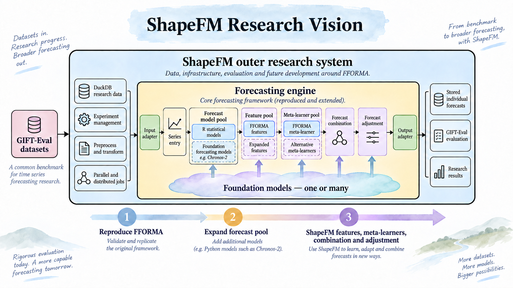

# ShapeFM research vision

ShapeFM is a research system built as two nested conceptual systems. The outer
ShapeFM system owns benchmark data, experiments, execution and evaluation. The
inner forecasting engine initially reproduces the useful structure of FFORMA,
then becomes the controlled research space in which ShapeFM expands the
forecast pool, features, meta-learners, forecast combination and forecast
adjustment.

This vision is the reference point for architecture and implementation
decisions. A change should support the vision directly or document why a
temporary deviation is necessary.

## Outer ShapeFM research system

The outer system receives GIFT-Eval datasets and owns the end-to-end research
workflow:

- canonical source data and benchmark metadata in DuckDB;
- experiment definitions, variants and evaluation windows;
- preprocessing and transformations;
- parallel and distributed job management;
- restart, provenance, failures and retries;
- persistent individual forecasts and research evidence; and
- official GIFT-Eval evaluation.

The outer system invokes forecasting through an explicit engine boundary. It
must not require the rest of the pipeline to understand the internal objects
used by an R statistical model, a Python foundation model or a future
meta-learner.

## Forecasting engine

The inner box is called the **Forecasting engine**, not the FFORMA engine,
because FFORMA is the reproducible starting point rather than the final limit
of the research.

The initial engine preserves the valuable FFORMA pattern:

- one managed series entry and forecast horizon;
- a registered pool of interchangeable forecast functions;
- a standard forecast mean vector of length `h` from each method;
- common execution, validation and documented fallback handling;
- a feature set used to describe each time series;
- a meta-learner that relates features to forecast performance; and
- comparable individual forecasts that can later be combined.

ShapeFM first reproduces this baseline. It then expands or replaces components
inside the engine without weakening the outer research contract.

## Input and output adapters

The input adapter translates one validated ShapeFM forecast job into the
complete internal object required by the selected engine provider. It owns the
boundary decision once; individual models must not independently reinterpret
the same observations or metadata.

The output adapter translates engine results back into ShapeFM's persistent
forecast contract. At minimum, every successful provider returns a finite mean
vector of exactly the requested horizon, together with identity and provenance.
The adapter records whether the requested model ran or a documented fallback
was used.

Internal R or Python objects remain inside their provider boundary. They do not
become the universal ShapeFM data representation and should not be repeatedly
converted between languages between individual operations.

## Forecast model pool

The pool begins with the statistical forecast methods used by FFORMA. It then
expands to additional R and Python providers, including foundation forecasting
models such as Chronos-2.

All providers remain independently addressable. Their forecasts are stored
separately so they can be inspected, evaluated and combined without rerunning
the model. A forecast matrix may be assembled from those stored outputs when a
combination method requires it, but the matrix is not the primary persistent
representation.

## Feature pool

The feature pool begins with the FFORMA features. ShapeFM then adds alternative
features and representations where the research requires them.

One or more foundation models may contribute learned representations or other
feature information. Foundation-model features supplement or compete with the
FFORMA baseline; they do not silently redefine it. Each feature family must
retain its method, model, version and transformation provenance.

## Meta-learner pool

The meta-learner pool begins with the FFORMA meta-learner. ShapeFM then tests
one or more alternative meta-learners.

A meta-learner may be a conventional statistical or machine-learning method,
a foundation model, or a system involving multiple foundation models. The
research must retain the baseline so improvements can be attributed to the
changed learner rather than to an unrecorded pipeline difference.

## Foundation models

Foundation models are not confined to one box. One or many foundation models
may contribute to:

- producing individual forecasts in the forecast model pool;
- generating or enriching time-series features;
- acting as, or contributing to, a meta-learner;
- selecting or calculating forecast combinations; and
- adjusting forecasts after or as part of combination.

These roles are independent. The same foundation model does not need to serve
all of them, and an experiment may use no foundation model, one model or
multiple models at each applicable role. Configuration and provenance must
make the selected role explicit.

## Forecast combination and adjustment

FFORMA's weighted combination is the starting comparison. ShapeFM will develop
its own decision process for selecting or weighting forecasts. Foundation
models may inform or perform this combination.

Forecast adjustment is a distinct research capability. It may refine an
individual forecast or a combined forecast, depending on the approved
experiment. Any adjustment must preserve the unadjusted forecast, identify the
method that changed it and remain independently evaluable.

## Research progression

The intended progression is:

1. **Reproduce FFORMA.** Validate the original forecast methods, features,
   meta-learner behaviour and comparable outputs.
2. **Expand the forecast pool.** Add statistical and foundation forecasting
   models through compatible provider adapters.
3. **Develop ShapeFM.** Expand features and meta-learners, then research
   foundation-model-supported combination and forecast adjustment.
4. **Evaluate evidence.** Compare individual models, FFORMA baselines and
   ShapeFM decisions under the same GIFT-Eval contracts.

This sequence describes research dependency, not a requirement to implement
the entire future design before validating an earlier gate.

## Stable contracts

The following principles should remain stable while internal methods evolve:

- ShapeFM owns canonical benchmark data, experiment identity and evaluation.
- Forecasting engines are accessed through explicit input and output adapters.
- Individual forecasts remain retrievable without rerunning models.
- Every forecast retains dataset, series, horizon, model and experiment identity.
- Preprocessing, transformation, fallback, model and adjustment provenance is
  explicit.
- FFORMA components remain identifiable as baselines when new components are
  introduced.
- Foundation-model roles are configured explicitly rather than inferred from
  a model name.
- Combination operates on comparable forecast outputs and does not destroy the
  underlying individual forecasts.

## Decision check

Every architecture or implementation decision should answer these questions:

1. Is this responsibility owned by the outer ShapeFM system, an adapter or the
   forecasting engine?
2. Does the change preserve a reproducible FFORMA baseline where applicable?
3. Does it expand a pool or silently replace an existing component?
4. Is a foundation model acting as a forecaster, feature generator,
   meta-learner, combination method or adjustment method?
5. Are inputs, outputs, versions, fallbacks and transformations traceable?
6. Can the individual forecast still be retrieved and evaluated independently?
7. Does the design permit future R and Python providers without making either
   language's internal object the universal data contract?

If a decision cannot answer these questions clearly, its boundary or
provenance contract is not yet sufficiently defined.
